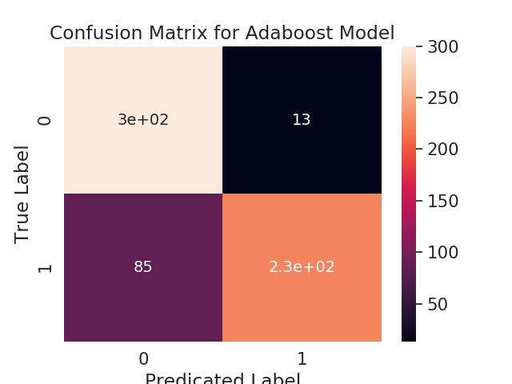

# huddl_assignment

## Steps
#### 1. Normalize the data: 
Read the data and extract the Subject and Message of the email. The rest of the fields are not necessary.
Once the subject and message are extracted, parse them to remove invalid characters such as "new line (\n)". 
Also ignore those message's which are forwarded. 
Remove regularly occurring stopwords and other words which frequently occur such as "Enron" which add no value to the learning 

#### 2. Generate heuristic rules for determining if a sentence is actionable or not:
Priority is given to subject and then to the message. The reason being a subject is a one-line summary of the entire email.
Hence, a subject containing actionable sentence is more relevant.
##### Rules 
    1. Named entity resolution
        To determing if the email talks about TIME.
    2. Part-of-speech tags extraction
        We consider only these POS tags 
        NN (for nouns)
        NNP (pronouns)
        PRP (personal pronouns) 
        VB (present tense verbs)
        VBD (past tense verb)
        VBZ (3rdperson singular verb)
        VBN (past participle)
        VBP (non-3rd person singular)
        MD (Modal Verb)
        
#### 3. Prepare data & perform Classification.
The data is then applied to the above Heuristic rules and then classified as actionable or not. 
The validity of this is verified against a Machine Learning Model. 
This model takes as input both, a distribution of values which are classified as non-actionable by the former model and the pre-tagged dataset given.

##### ML Models used
    1. Naive Bayes
    2. Logistic Regression
    3. Decision Tree
    4. Random Forest
    5. Extra Tree 
    6. Adaboost
    7. Multi-Layer Perceptron

#### 4. Report results
The results are reported and the best accuracy is reported by the nueral network MLP 95%. 
The precision, recall and f1-score values are 0.94, 0.94, 0.94. 

#### 5. Running the Model on the pre-tagged texts
While running the model on the pre-tagged texts, it reported accuracy 100%. 
Hence, it can be inferred that the decrease in model's accuracy can be attributed to the fact that there is lot of noise present in the data.

## Instructions
1. If main method of TestModel class get's the test flag as False, it'll run and generate all the models. 
2. If main method of TestModel class get's the test flag as True, it'll prompt the user to enter a sentence in command line.
3. Once the sentence is entered, two predictions are returned
    a. The predictions of the heuristic model i.e., applying linguistic rules, is the sentence an actionable item or not.
    b. The predictions of the best ML model i.e., MLP is given.
    c. The final prediction is an aggregation of both the above outputs.  